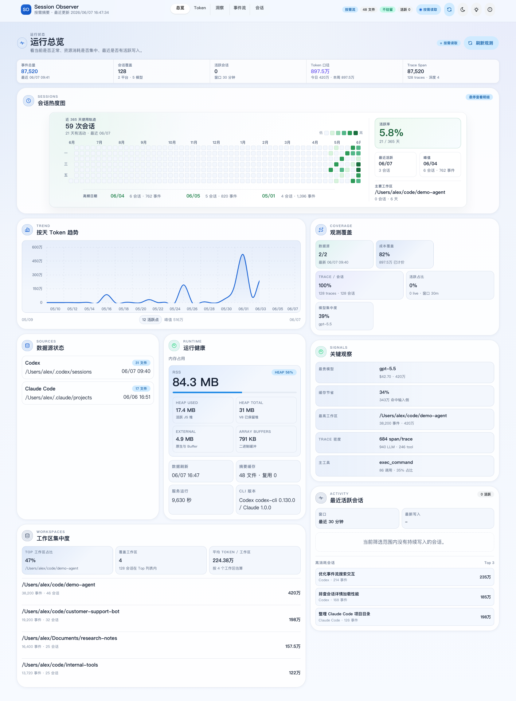
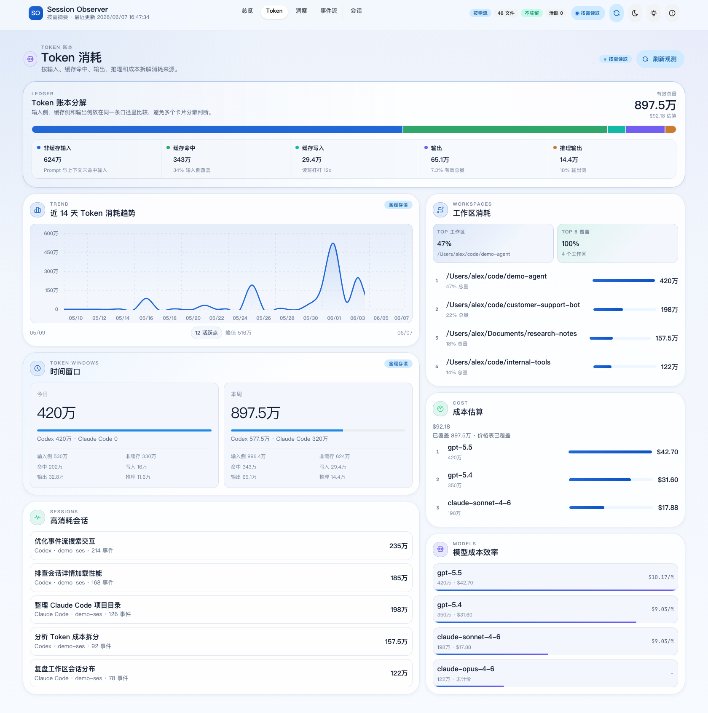
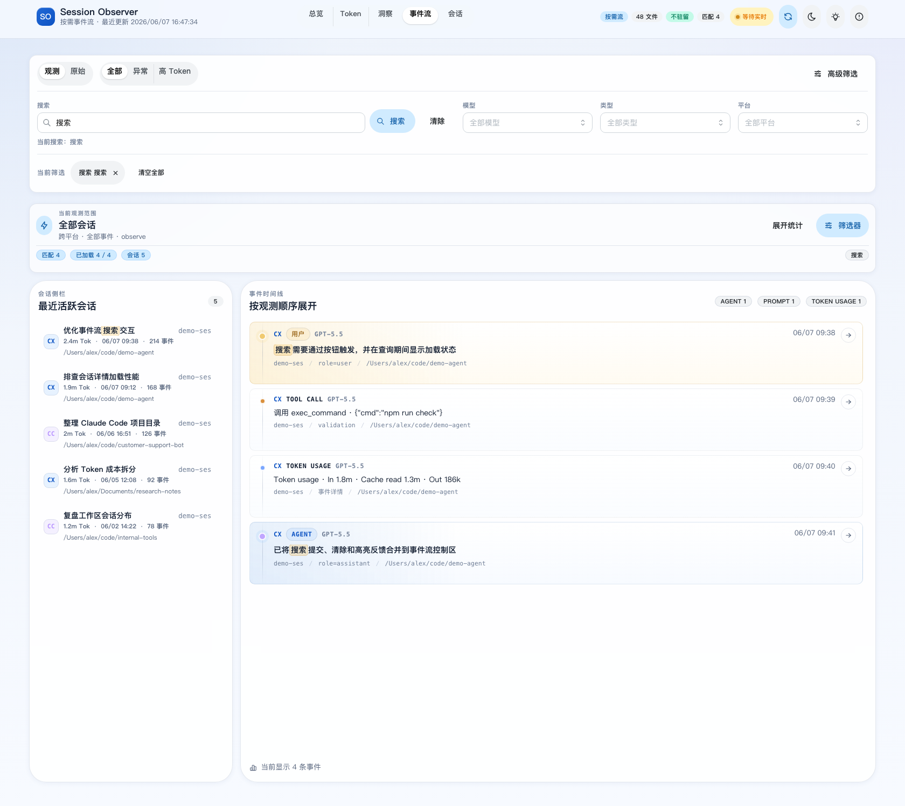
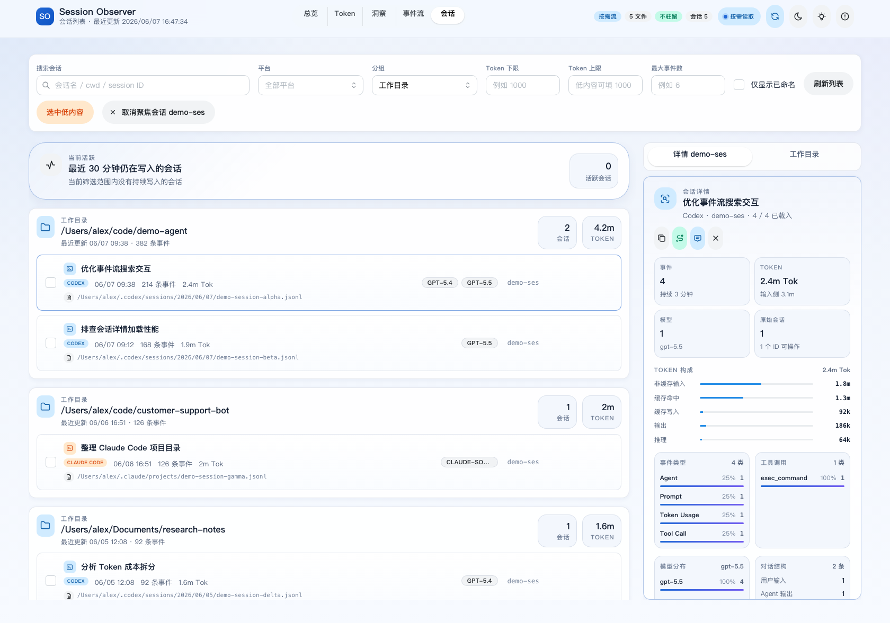

# Session Observer

本地优先的 Codex / Claude Code 会话观测工作台。它读取本机会话日志，帮助你查看事件流、会话详情、Token 消耗、工作目录分布、活跃热度和运行内存状态。

Session Observer 默认只监听本机 `127.0.0.1`，不会上传会话内容，也不会把原始 JSONL 文件提交到仓库。



## Highlights

- **本地优先观测**: 读取 Codex 与 Claude Code 的本机 JSONL 日志，统一成一个可搜索、可跳转的工作台。
- **按需事件流**: 事件流按需读取最近事件，支持按钮触发搜索、加载状态、关键词高亮、平台/模型/类型筛选和单会话聚焦。
- **会话工作区**: 按工作目录、来源文件或平台分组，支持活跃会话、工作目录树、会话详情、对话抽屉、重命名、删除和复制 session ID。
- **完整会话详情**: 展示开始时间、最近写入、事件数量、Token 构成、模型分布、工具调用、事件类型和最近事件。
- **Token 账本**: 区分非缓存输入、缓存命中、缓存写入、输出与推理输出，并按时间窗口、模型、工作区和高消耗会话拆分。
- **运行总览**: 提供事件总量、会话覆盖、Trace Span、会话热度图、数据源状态、运行内存、工作区集中度和关键观察。
- **低内存策略**: 默认避免把完整历史 JSONL 常驻内存，事件流、会话详情和搜索按需读取；页面直接展示 RSS、Heap、External 等运行内存指标。

## Screenshots

截图使用脱敏示例数据生成，不包含真实路径、prompt、工具输出或原始会话内容。

| Token 消耗 | 事件流 |
| --- | --- |
|  |  |

| 会话详情 | 运行总览 |
| --- | --- |
|  |  |

## Data Sources

默认读取以下本机目录:

| 平台 | 默认位置 | 说明 |
| --- | --- | --- |
| Codex | `~/.codex/sessions/**/*.jsonl` | Codex 会话事件、Token、工具调用和消息流 |
| Claude Code | `~/.claude/projects/**/*.jsonl` | Claude Code 项目会话、工具调用和消息流 |
| Codex state | `~/.codex/state_5.sqlite` | Codex 会话标题元数据，依赖 `sqlite3` CLI |

## Requirements

- Node.js: 建议使用当前 LTS 或更新版本
- npm
- `sqlite3` CLI: 用于读取 Codex 会话标题元数据
- 现代桌面浏览器

## Quick Start

```bash
npm install
./manage.sh start
./manage.sh open
```

默认地址是 `http://127.0.0.1:8787`。

`manage.sh` 会在 `dist/` 缺失或前端源码更新时自动执行 `npm run build`。开发 UI 时可以直接运行:

```bash
npm run dev
```

## Common Commands

```bash
./manage.sh start      # 后台启动本地服务
./manage.sh status     # 查看运行状态
./manage.sh logs -f    # 跟随服务日志
./manage.sh stop       # 停止服务
./manage.sh run        # 前台运行，便于调试

npm test               # 运行前端 Vitest 测试
npm run test:core      # 运行共享解析与聚合测试
npm run build          # 构建前端产物
npm run check          # lint、测试核心逻辑并构建
```

## Feature Map

| 页面 | 主要能力 |
| --- | --- |
| 总览 | 运行状态、会话热度图、Token 趋势、观测覆盖、数据源状态、内存占用、工作区集中度、最近活跃会话 |
| Token | Token 账本分解、缓存命中、缓存写入、输出、推理输出、时间窗口、模型成本、工作区消耗、高消耗会话 |
| 洞察 | 活跃率、会话负载、工具调用、工作区负载、活动形态和关键观察 |
| 事件流 | 观察/原始模式、搜索提交、高亮、加载态、筛选器、事件时间线、最近活跃会话、跳转会话详情 |
| 会话 | 分组列表、工作目录树、活跃会话、详情面板、会话对话、单会话聚焦、批量删除、低内容选择 |

## Architecture

```text
server.js              Node HTTP API、静态资源服务、会话管理接口
manage.sh              本地服务生命周期脚本
shared/                Codex / Claude Code 解析、去重、聚合逻辑
src/app.jsx            React 工作台壳、路由状态和页面编排
src/components/        总览、事件流、会话页、详情抽屉、对话抽屉
src/hooks/             数据加载、实时文件变化、会话操作和 URL 状态同步
src/lib/               视图模型、格式化、分页、URL 编码
src/styles/app.css     产品 UI 样式和设计变量
tests/                 Node 侧解析和聚合测试
```

后端保持单进程本地服务，前端由 Vite 构建后由同一个 Node 服务托管。共享解析逻辑放在 `shared/`，避免前后端重复实现事件归一化、Token 聚合和会话分组。

## Configuration

| 变量 | 默认值 | 说明 |
| --- | --- | --- |
| `HOST` | `127.0.0.1` | HTTP 监听地址 |
| `PORT` | `8787` | HTTP 端口 |
| `CODEX_SESSIONS_DIR` | `~/.codex/sessions` | Codex 会话目录 |
| `CLAUDE_PROJECTS_DIR` | `~/.claude/projects` | Claude Code 项目目录 |
| `CODEX_STATE_DB` | `~/.codex/state_5.sqlite` | Codex 标题元数据 SQLite |

示例:

```bash
PORT=8790 CODEX_SESSIONS_DIR=/path/to/codex/sessions ./manage.sh start
```

## Privacy

会话日志可能包含 prompt、工具输出、本地路径、代码片段和其他敏感信息。请不要提交原始 JSONL、手动整理出的会话内容或 `.runtime/` 内容。截图、Issue、PR 描述和文档示例应使用脱敏数据。

如果需要绑定到非本机地址，请先确认网络访问范围和日志暴露风险:

```bash
HOST=0.0.0.0 ./manage.sh start
```
